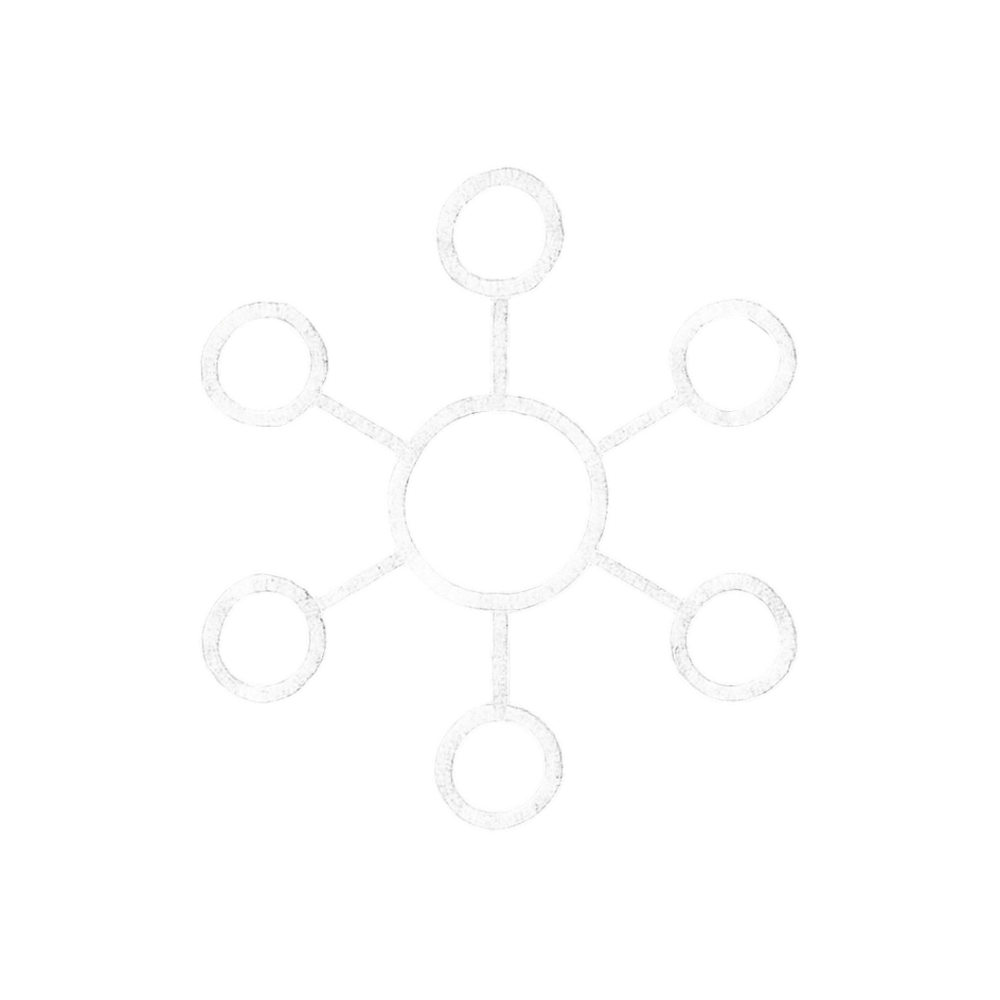

<div align="center">
  

  <h1>bubbles</h1>

  <p>
    A graph-based AI conversation interface for exploring ideas without losing your train of thought.
  </p>

  <p>
    <strong>Branch conversations naturally. Follow curiosity freely. Keep every thread in context.</strong>
  </p>

  <p>
    
    
    
    
  </p>
</div>

## Overview

Bubbles is built for exploratory thinking. Instead of forcing every follow-up into one long linear chat, it turns conversations into a navigable canvas where each question can become its own branch.

Use it to learn a new topic, chase side questions, return to earlier threads, and keep the full shape of your reasoning visible.

## Highlights

- **Conversation graph:** Ask a question, branch from any response, and keep related ideas connected.
- **Context-aware threads:** Each branch preserves its own path through the conversation tree.
- **Fullscreen focus mode:** Open any node as a focused chat thread when you want depth.
- **Persistent canvases:** Save, rename, delete, and revisit conversation canvases per user.
- **Auth built in:** Email/password and Google OAuth are handled through Supabase.
- **Streaming AI responses:** Gemini streaming support with a Perplexity fallback path.
- **Canvas ergonomics:** Mini map, background grid, smart panning, undo delete, search, and mobile guardrails.
- **Production-minded API layer:** Request validation, auth checks, rate limiting, and health checks are included.

## Tech Stack

- **Framework:** Next.js App Router
- **Language:** TypeScript
- **UI:** React, Tailwind CSS, Radix UI primitives, Lucide icons
- **Canvas:** React Flow
- **Layout:** Dagre plus local tree layout orchestration
- **Auth and data:** Supabase
- **AI providers:** Gemini 2.5 Flash, with optional Perplexity fallback
- **Testing:** Jest and Testing Library

## Getting Started

### 1. Install dependencies

```bash
npm install
```

### 2. Configure environment variables

Create a `.env.local` file in the project root:

```bash
NEXT_PUBLIC_SUPABASE_URL=your_supabase_project_url
NEXT_PUBLIC_SUPABASE_ANON_KEY=your_supabase_anon_key

# At least one AI provider key is recommended.
GEMINI_API_KEY=your_gemini_api_key
PERPLEXITY_API_KEY=your_perplexity_api_key
```

If no AI key is provided, the chat route returns a mock response so the app can still be exercised during local setup.

### 3. Set up Supabase

Run the SQL migrations in `supabase/migrations` against your Supabase project. They create the `canvases` table, row level security policies, indexes, and timestamp triggers used by the app.

### 4. Start the development server

```bash
npm run dev
```

Open [http://localhost:3000](http://localhost:3000) and sign in to start building a canvas.

## Available Scripts

```bash
npm run dev        # Start the local development server
npm run build      # Build the production app
npm run start      # Start the production server
npm run lint       # Run ESLint
npm run typecheck  # Run TypeScript checks
npm run test       # Run Jest tests
```

## Project Structure

```text
app/
  api/              API routes for chat and health checks
  auth/             Supabase auth callback route
  privacy/          Privacy policy page
components/
  auth/             Authentication modal
  canvas/           Conversation graph, nodes, dialogs, controls, hooks
  landing/          Public landing page
  layout/           App sidebar
  shared/           Shared rendering components
  ui/               Reusable UI primitives
lib/
  contexts/         Auth provider
  layout/           Tree layout engine and tests
  utils/            Canvas layout and viewport helpers
supabase/
  migrations/       Database schema and RLS policies
public/
  logo.png          Bubbles logo and app icons
```

## How It Works

1. A user signs in through Supabase.
2. The app loads that user's saved canvases.
3. A new question creates a conversation node on the React Flow canvas.
4. Follow-up questions branch from the selected node.
5. The API validates and rate-limits requests, then streams an AI response.
6. Nodes and edges are persisted back to Supabase as the canvas evolves.

## Quality Checks

Before opening a pull request, run:

```bash
npm run lint
npm run typecheck
npm run test
npm run build
```

## Privacy

Bubbles includes a privacy page at `/privacy`. User canvases are protected with Supabase row level security so each user can only access their own saved conversation graphs.

## Status

Bubbles is currently in beta. The core flow is built around authenticated, persistent conversation canvases with branching AI conversations.
